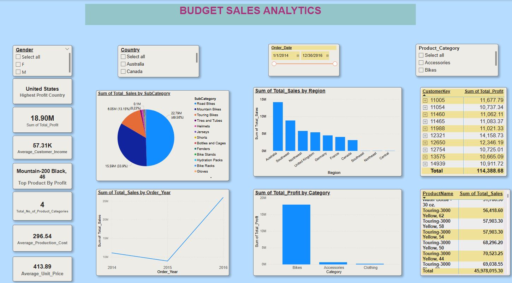
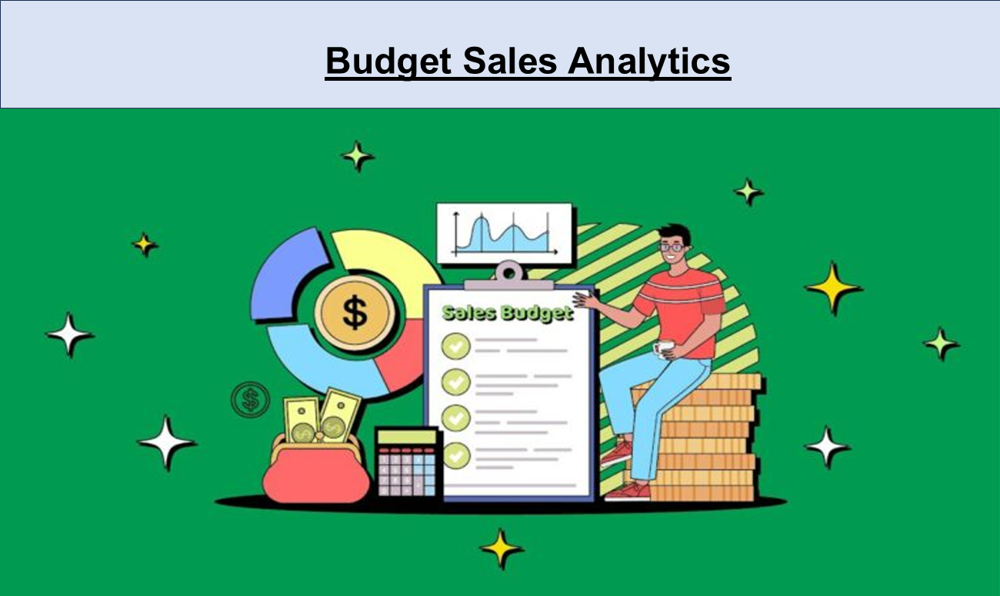

# Budget, Sales, and Analytics Dashboard

##  Project Overview

###  Project Title
**Budget, Sales, and Analytics Dashboard**

###  Description
This Power BI project delivers a detailed and interactive dashboard that offers insights into core business metrics such as budget allocation, sales performance, and profitability. It provides a user-friendly interface for exploring different dimensions of business data.

###  Key Analytical Areas

- **Budget Insights**: Displays visual representations of budget distribution across categories to provide a clear picture of resource allocation.
- **Sales Analysis**: Utilizes charts and tables to evaluate sales trends, performance indicators, and data patterns.
- **Profitability Overview**: Highlights profit margins segmented by product category, subcategory, and region to pinpoint both high and low-performing areas.
- **Customer Metrics**: Presents insights into the customer base using data points such as total customers and average annual income.
- **Product Performance**: Analyzes product-level sales to identify top-selling items and those with higher tax rates.
- Regional Breakdown**: Provides region-wise analysis of sales and profit data, helping to assess performance across various territories.

---

##  Key Features

- **Interactive Filters**: Enables users to filter data by dimensions like region, category, and time period to focus analysis on specific segments.
- **Drill-Down Functionality**: Allows exploration of detailed data beneath summarized visuals, uncovering deeper insights.
- **Customizable Layout**: Offers flexibility in modifying the visuals and layout to suit individual user needs and reporting formats.

---

##  Objectives

- Deliver a streamlined overview of budget usage, sales outcomes, and profitability.
- Discover patterns and trends in sales and financial performance.
- Enable data-driven decision-making with actionable intelligence.
- Support collaboration and informed discussions by sharing a unified view of business health.

---

##  Intended Users

This dashboard serves a broad audience within the organization, including:

- Business Managers
- Financial Analysts
- Executives
- Other stakeholders who depend on timely, accurate business data for strategic planning and operational decisions.

---

## Overall Report & Dashboard Glimpse:

